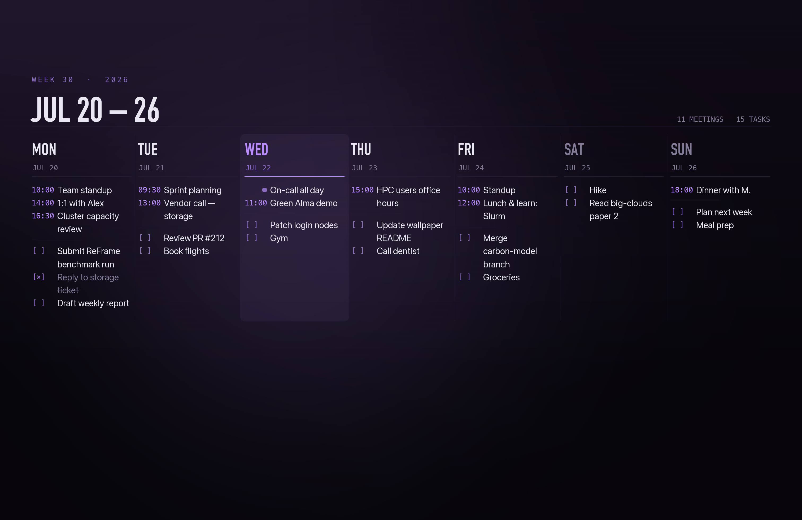

# 🗓️ Weekly Wallpaper

Plan your week — meetings synced from **Apple Calendar** plus personal
**to-dos** — and turn it into a clean MacBook Pro wallpaper you can refresh
whenever plans change. Built with Streamlit + Pillow; sets the desktop via
AppleScript.

Designed for a 14" MacBook Pro (3024 × 1964) and rendered at 2× that
(**6048 × 3928**) so it stays crisp on any display — tune `Theme.scale`
in `render.py` to go higher or lower.



**macOS only** — it reads Apple Calendar via `icalBuddy`, sets the desktop via
AppleScript, and uses the fonts that ship with macOS.

## Setup

The Python environment is managed with [uv](https://docs.astral.sh/uv/):
dependencies are declared in `pyproject.toml`, exact versions are pinned in
`uv.lock`, and `uv` creates a project-local `.venv` from them on first run —
nothing is installed globally.

```bash
brew install uv ical-buddy    # icalBuddy reads Apple Calendar (one time)
uv sync                       # creates .venv with streamlit + pillow
```

No uv? Plain pip works too: `pip install streamlit pillow` and drop the
`uv run` prefix from the commands below.

## Run

```bash
uv run streamlit run app.py
```

…or just **double-click `run.command`** in Finder.

Then:

1. **Pick the week** (weeks start Monday).
2. **🔄 Sync Apple Calendar** — pulls that week's meetings.
3. Type **to-dos** under each day, one per line. Prefix a line with `x ` to
   show it as done (struck through). To-dos save themselves per week in
   `data/todos.json`.
4. The preview redraws as you type — hit **🖥️ Set as wallpaper** when it looks
   right (or **⬇️ Download PNG**).

Each render is written to `out/wallpaper-<week>-<hash>.png`. The hash matters:
macOS caches the desktop picture *by path*, so reusing one filename leaves the
old image on screen however new the file is. Only the newest few are kept.

> The first time you set the wallpaper, macOS may ask for permission for your
> terminal to control **System Events** — click **OK**
> (System Settings → Privacy & Security → Automation).

## Meetings from a work calendar (no Apple ID needed)

icalBuddy reads whatever's in the macOS **Calendar** app, including **Google**,
**Microsoft 365 / Exchange**, and subscribed calendars — none of which require
signing into iCloud.

1. **System Settings → Internet Accounts → Add Account** → pick Google or
   Microsoft Exchange, sign in, and enable *Calendars*.
2. **🔄 Sync Apple Calendar** — by default this pulls **all** your calendars'
   events. (Reminders are tasks, not events, so they never appear.)
3. *Optional:* open the **📅 Calendars** popover at the top of the page, pick
   a subset and **Save** if you ever want to exclude things like Birthdays or
   Holidays. **Use all** returns to everything. Saved in `data/config.json`.

## Files

| File | Purpose |
|------|---------|
| `app.py` | Streamlit UI |
| `render.py` | Pillow renderer (7-column layout, themeable via `Theme`) |
| `calendar_sync.py` | Apple Calendar → meetings, via `icalBuddy` |
| `wallpaper.py` | Set / read the macOS wallpaper (AppleScript) |
| `store.py` | Per-week to-do persistence (`data/todos.json`) |

## Tweaking the design

All colours, sizes and spacing live in the `Theme` dataclass in `render.py`.
Preview changes fast without the UI:

```bash
uv run python render.py     # writes out/wallpaper.png with sample data
```

## Command-line only (no UI)

```python
import datetime as dt
from render import Week, Theme, render_week
from calendar_sync import fetch_week_meetings
from store import get_week
import wallpaper

monday = dt.date.today() - dt.timedelta(days=dt.date.today().weekday())
week = Week.build(monday, fetch_week_meetings(monday), get_week(monday))
render_week(week, Theme()).save("out/wallpaper.png")
wallpaper.set_wallpaper("out/wallpaper.png")
```
